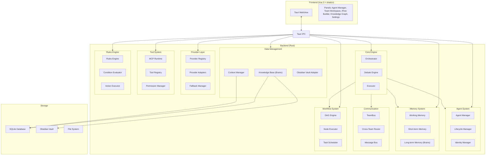
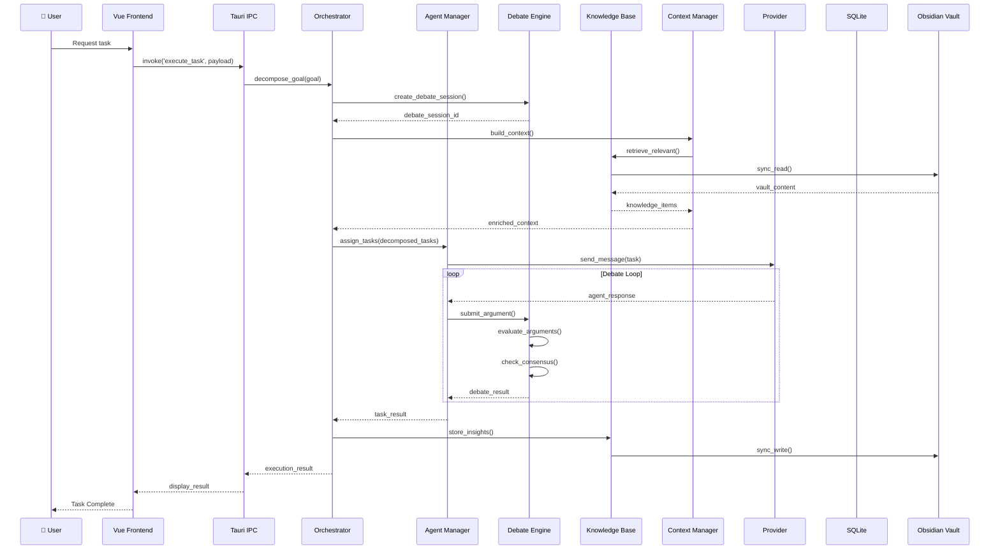
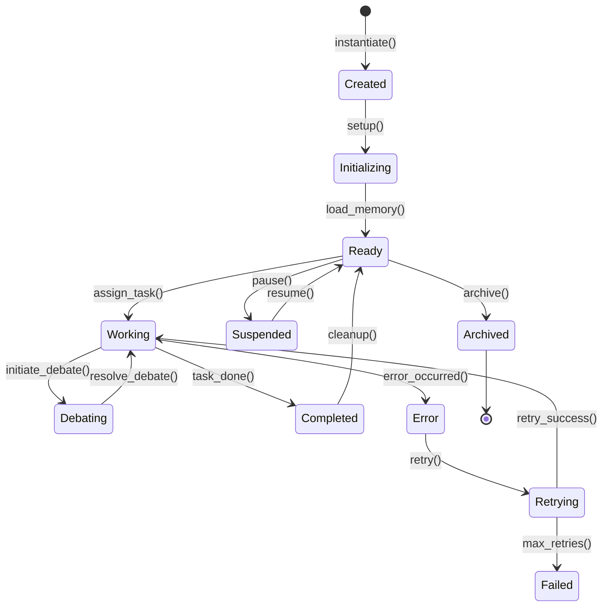
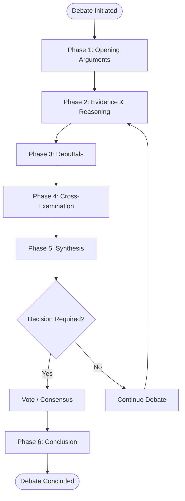
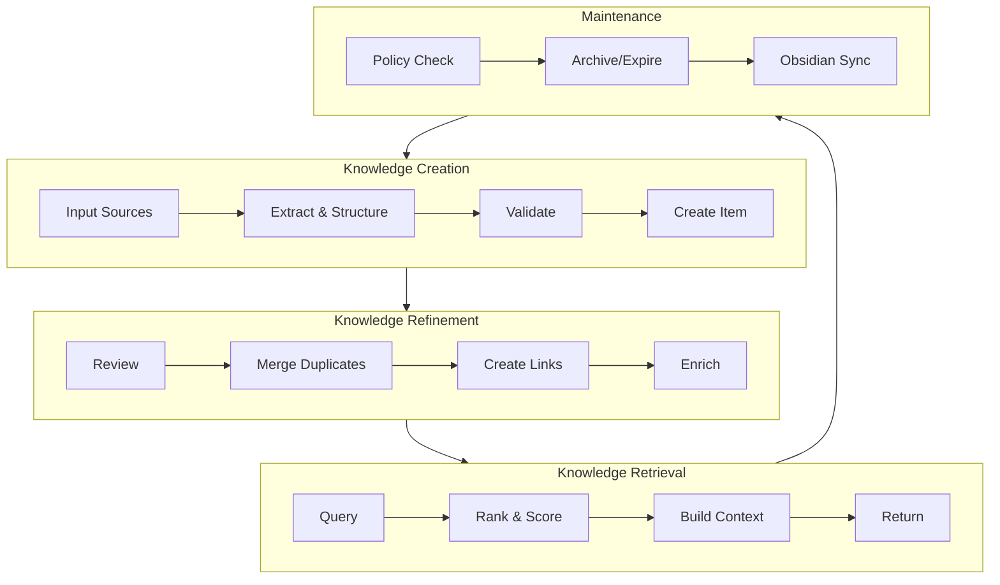
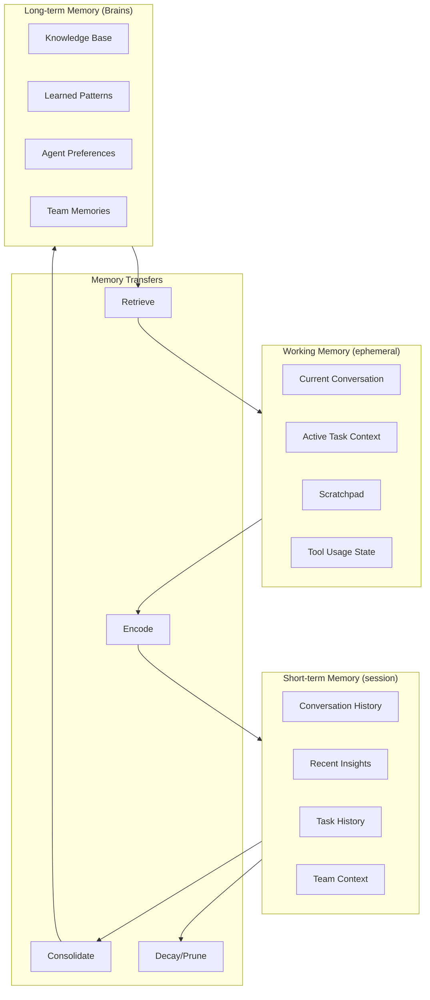
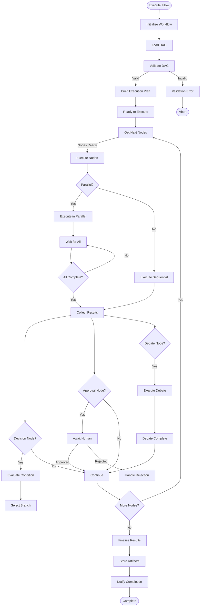

# blue9 v2.0 - Technical Requirements Specification

**Multi-Agent Orchestration Platform with Humanlike Debate & Collaborative Intelligence**

**Technology Stack:** Tauri (Rust + Vue 3 + shadcn/ui + TypeScript)

**Version:** 2.0 | May 2026

---

## Table of Contents

1. [Vision & Philosophy](#1-vision--philosophy)
2. [System Architecture](#2-system-architecture)
3. [Agent System](#3-agent-system)
4. [Team Collaboration & Debate Protocol](#4-team-collaboration--debate-protocol)
5. [Knowledge Management System (Brains)](#5-knowledge-management-system-brains)
6. [Context & Memory Management](#6-context--memory-management)
7. [Provider Management](#7-provider-management)
8. [MCP Tools & Extensions](#8-mcp-tools--extensions)
9. [iFlow Workflow Engine (DAG)](#9-iflow-workflow-engine-dag)
10. [Automation & Rules Engine](#10-automation--rules-engine)
11. [Graph Visualization](#11-graph-visualization)
12. [UI/UX Design](#12-ux-design)
13. [Data Models](#13-data-models)
14. [Non-Functional Requirements](#14-non-functional-requirements)

---

## 1. Vision & Philosophy

### 1.1 Core Vision
blue9 v2.0 envisions a collaborative AI ecosystem where multiple specialized agents form teams, engage in structured debates, share knowledge dynamically, and collectively solve complex problems through orchestrated workflows. Unlike traditional single-agent systems, blue9 emphasizes **humanlike collaboration** with debate protocols, consensus mechanisms, and transparent reasoning chains.

**Key Philosophy:**
- **Collaborative Intelligence**: Agents don't just execute tasks—they critique, debate, and refine solutions collectively
- **Knowledge as a Living System**: Knowledge is continuously captured, refined, and shared through the Brains system
- **Transparent Reasoning**: Every decision and debate is logged and traceable
- **Adaptive Memory**: Context is managed intelligently across short-term and long-term storage
- **Provider Agnostic**: Abstract away provider differences while leveraging unique strengths

### 1.2 Key Differentiators

| Feature | Traditional Systems | blue9 v2.0 |
|---------|---------------------|-----------------|
| Agent Communication | Direct message passing | Structured debate with arguments, rebuttals, consensus |
| Knowledge Management | Static database | Dynamic Brains with semantic graphs |
| Memory | Single context window | Tiered memory (working/short-term/long-term) |
| Workflow Definition | Code-based DAGs | Visual DAG builder with debate checkpoints |
| Provider Integration | Hard-coded adapters | Hot-swappable provider registry |
| Context Management | Manual truncation | Intelligent compression & extraction |

---

## 2. System Architecture

### 2.1 Technology Stack

```
┌─────────────────────────────────────────────────────────────┐
│                    Presentation Layer                       │
│                  Vue 3 + shadcn/ui + TypeScript              │
│                  (Tauri WebView)                              │
└─────────────────────────────────────────────────────────────┘
                              │
                     Tauri IPC Bridge
                              │
┌─────────────────────────────────────────────────────────────┐
│                     Backend (Rust)                          │
│  ┌─────────────┐ ┌─────────────┐ ┌──────────────────────┐  │
│  │ Orchestrator│ │Agent Manager│ │ Session Manager      │  │
│  └─────────────┘ └─────────────┘ └──────────────────────┘  │
│  ┌─────────────┐ ┌─────────────┐ ┌──────────────────────┐  │
│  │ Debate Engine│ │KB Manager  │ │ Context Manager     │  │
│  └─────────────┘ └─────────────┘ └──────────────────────┘  │
│  ┌─────────────┐ ┌─────────────┐ ┌──────────────────────┐  │
│  │ MCP Runtime │ │iFlow Engine │ │ Provider Registry    │  │
│  └─────────────┘ └─────────────┘ └──────────────────────┘  │
└─────────────────────────────────────────────────────────────┘
                              │
┌─────────────────────────────────────────────────────────────┐
│                    Data Layer                                │
│  SQLite (rusqlite) + Obsidian Vault + File System           │
└─────────────────────────────────────────────────────────────┘
```

### 2.2 Component Architecture



### 2.3 Data Flow



---

## 3. Agent System

### 3.1 Agent Architecture

```typescript
interface Agent {
  id: string;
  name: string;
  role: AgentRole;
  personality: Personality;
  provider: ProviderBinding;
  skills: Skill[];
  memory_config: MemoryConfig;
  debate_config: DebateConfig;
  rules: Rule[];
}

interface Personality {
  creativity: number; // 0-1
  caution: number;     // 0-1
  verbosity: number;  // 0-1
  empathy: number;    // 0-1
}

interface AgentRole {
  name: string;           // e.g., "Architect", "Developer", "Critic", "Researcher"
  responsibilities: string[];
  expertise: string[];
  collaboration_style: 'proposer' | 'critic' | 'synthesizer' | 'executor';
}

interface ProviderBinding {
  primary: string;       // Provider ID
  fallback: string[];    // Fallback provider IDs
  context_window: number;
  strengths: string[];
}
```

### 3.2 Agent Lifecycle



### 3.3 Agent Communication Protocol

**Message Types:**
```typescript
type MessageType =
  | 'task_assignment'
  | 'status_update'
  | 'debate_argument'
  | 'debate_rebuttal'
  | 'knowledge_request'
  | 'knowledge_share'
  | 'help_request'
  | 'consensus_proposal'
  | 'abort_signal';
```

**Message Structure:**
```typescript
interface AgentMessage {
  id: string;
  type: MessageType;
  sender: string;        // Agent ID
  recipients: string[];  // Agent IDs or 'broadcast'
  content: MessageContent;
  metadata: {
    timestamp: number;
    correlation_id: string;
    parent_debate_id?: string;
    reply_to?: string;
    priority: 'low' | 'normal' | 'high' | 'urgent';
  };
}

interface MessageContent {
  subject: string;
  body: string;
  attachments?: Attachment[];
  context_summary?: string;
  reasoning_chain?: ReasoningStep[];
}
```

### 3.4 Agent Categories

1. **Proposer Agents**: Generate initial solutions, proposals, or ideas
2. **Critic Agents**: Analyze weaknesses, identify risks, challenge assumptions
3. **Synthesizer Agents**: Combine insights, find common ground, resolve conflicts
4. **Executor Agents**: Implement solutions, execute tasks, validate results
5. **Researcher Agents**: Gather information, analyze data, provide insights
6. **Coordinator Agents**: Orchestrate debates, manage workflows, ensure progress

---

## 4. Team Collaboration & Debate Protocol

### 4.1 Team Structure

```typescript
interface Team {
  id: string;
  name: string;
  purpose: string;
  instance_id: string;
  members: TeamMember[];
  debate_config: DebateConfig;
  shared_knowledge: SharedKnowledgeScope;
  governance: GovernanceRules;
}

interface TeamMember {
  agent_id: string;
  role: AgentRole;
  permissions: Permission[];
  active_debates: string[];
  contribution_score: number;
}
```

### 4.2 Debate Protocol

The debate system is the core of blue9's collaborative intelligence. Agents engage in structured debates to refine solutions, identify weaknesses, and reach consensus.

**Debate Phases:**



**Debate Configuration:**
```typescript
interface DebateConfig {
  debate_id: string;
  topic: string;
  goal: string;               // What needs to be decided
  participants: string[];      // Agent IDs
  roles: DebateRoles;
  max_rounds: number;
  time_limit?: number;         // milliseconds
  consensus_threshold: number; // 0-1
  voting_enabled: boolean;
  moderator?: string;           // Moderator agent ID
  knowledge_scope: string[];  // Relevant knowledge domains
}

interface DebateRoles {
  proposer: string;           // Agent leading the proposal
  critics: string[];         // Agents challenging the proposal
  synthesizer?: string;      // Agent resolving conflicts
  witnesses?: string[];      // Agents providing evidence
}
```

### 4.3 Argument Structure

```typescript
interface DebateArgument {
  id: string;
  debate_id: string;
  author: string;
  type: ArgumentType;
  claim: string;
  evidence: Evidence[];
  reasoning: ReasoningChain;
  strength: number;           // 0-10, calculated
  objections: Objection[];
  timestamp: number;
}

type ArgumentType =
  | 'proposal'
  | 'critique'
  | 'evidence'
  | 'counter-example'
  | 'analogy'
  | 'refinement'
  | 'consensus';

interface Evidence {
  type: 'data' | 'example' | 'reference' | 'calculation';
  content: string;
  source?: string;
  relevance_score: number;
}

interface ReasoningChain {
  premises: string[];
  inference: string;
  conclusion: string;
  logical_connectors: string[]; // "therefore", "because", "however"
}

interface Objection {
  argument_id: string;
  objector: string;
  type: ObjectionType;
  content: string;
  strength: number;
}

type ObjectionType =
  | 'factual_error'
  | 'logical_flaw'
  | 'unfounded_assumption'
  | 'missing_context'
  | 'alternative_interpretation';
```

### 4.4 Consensus Mechanism

```typescript
interface ConsensusResult {
  reached: boolean;
  decision?: string;
  confidence: number;
  votes?: Vote[];
  dissenting_opinions?: Dissent[];
  synthesis?: string;
}

interface Vote {
  voter: string;
  position: 'approve' | 'reject' | 'abstain' | 'modify';
  rationale: string;
  weight: number;          // Based on expertise
}

interface Dissent {
  dissenters: string[];
  position: string;
  concerns: string[];
  severity: 'minor' | 'major' | 'blocking';
}
```

**Consensus Calculation:**
1. Calculate weighted vote average
2. Check if threshold exceeded (configurable, default 0.7)
3. If not reached, identify blockers
4. Trigger refinement round for dissenting opinions
5. Repeat until consensus or max rounds reached

### 4.5 Cross-Team Debate Protocol

```typescript
interface CrossTeamDebate {
  protocol_id: string;
  teams: string[];         // Team instance IDs
  shared_goal: string;
  terms: CollaborationTerms;
  state: ProtocolState;
  sessions: DebateSession[];
  outcome?: string;
}

interface CollaborationTerms {
  knowledge_sharing_level: 'none' | 'read' | 'write' | 'full';
  task_delegation_allowed: boolean;
  consensus_required_from: 'any' | 'majority' | 'all';
  dispute_resolution: 'arbitration' | 'vote' | 'senior_agent';
}

type ProtocolState =
  | 'initiated'
  | 'negotiating'
  | 'active'
  | 'paused'
  | 'concluded'
  | 'terminated';
```

---

## 5. Knowledge Management System (Brains)

### 5.1 Brains Architecture

The Brains system is blue9's central knowledge repository, designed for efficient storage, retrieval, and semantic querying of organizational knowledge.

```typescript
interface Brain {
  id: string;
  name: string;
  description: string;
  owner_scope: 'agent' | 'team' | 'organization';
  storage: StorageConfig;
  indexing: IndexingConfig;
  sync_config?: ObsidianSyncConfig;
}

interface KnowledgeItem {
  id: string;
  title: string;
  content: string;
  format: 'markdown' | 'structured' | 'code' | 'data';
  metadata: ItemMetadata;
  embeddings: number[];      // Vector embeddings
  links: Link[];            // Internal links
  tags: string[];
  confidence: number;        // Reliability score
  source: Provenance;
  version: number;
  created_at: number;
  updated_at: number;
}

interface ItemMetadata {
  author: string;           // Agent or user ID
  domain: string[];
  language: string;
  complexity: 'simple' | 'moderate' | 'complex';
  use_cases: string[];
  related_tasks: string[];
  validity_period?: {
    start: number;
    end?: number;
  };
}

interface Link {
  target_id: string;
  link_type: 'references' | 'elaborates' | 'contradicts' | 'depends_on';
  context?: string;
}

interface Provenance {
  origin: 'agent_interaction' | 'manual_entry' | 'imported' | 'web_research';
  agent_id?: string;
  session_id?: string;
  confidence_modifiers?: string[];
}
```

### 5.2 Knowledge Storage Schema

```sql
CREATE TABLE knowledge_items (
  id TEXT PRIMARY KEY,
  brain_id TEXT NOT NULL,
  title TEXT NOT NULL,
  content TEXT NOT NULL,
  format TEXT DEFAULT 'markdown',
  embeddings BLOB,
  tags JSON,
  metadata JSON,
  confidence REAL DEFAULT 1.0,
  source JSON,
  version INTEGER DEFAULT 1,
  created_at INTEGER,
  updated_at INTEGER,
  obsidian_path TEXT,
  FOREIGN KEY (brain_id) REFERENCES brains(id)
);

CREATE TABLE knowledge_links (
  id TEXT PRIMARY KEY,
  source_id TEXT NOT NULL,
  target_id TEXT NOT NULL,
  link_type TEXT NOT NULL,
  context TEXT,
  FOREIGN KEY (source_id) REFERENCES knowledge_items(id),
  FOREIGN KEY (target_id) REFERENCES knowledge_items(id)
);

CREATE TABLE brains (
  id TEXT PRIMARY KEY,
  name TEXT NOT NULL,
  description TEXT,
  owner_scope TEXT NOT NULL,
  owner_id TEXT,
  storage_config JSON,
  indexing_config JSON,
  sync_config JSON,
  created_at INTEGER,
  updated_at INTEGER
);

CREATE VIRTUAL TABLE knowledge_fts USING fts5(
  title, content, tags,
  content='knowledge_items',
  content_rowid='rowid'
);
```

### 5.3 Knowledge Retrieval & Ranking

```typescript
interface KnowledgeQuery {
  query: string;
  filters?: QueryFilters;
  ranking_strategy: 'relevance' | 'recency' | 'confidence' | 'combined';
  max_results: number;
  include_context: boolean;
  expand_related: boolean;
}

interface QueryFilters {
  brain_ids?: string[];
  domains?: string[];
  tags?: string[];
  date_range?: { start: number; end: number };
  confidence_min?: number;
  formats?: string[];
  source?: string[];
}

interface KnowledgeSearchResult {
  item: KnowledgeItem;
  relevance_score: number;
  match_highlights: string[];
  context_snippet: string;
  related_items: RelatedItem[];
}

// Retrieval Pipeline
async function retrieveKnowledge(query: KnowledgeQuery): Promise<KnowledgeSearchResult[]> {
  // 1. Vector similarity search
  const vector_results = await vectorStore.similaritySearch(
    query.embeddings,
    query.max_results * 2
  );

  // 2. Full-text search
  const fts_results = await db.ftsQuery(query.query, query.filters);

  // 3. Merge and deduplicate
  const merged = mergeResults(vector_results, fts_results);

  // 4. Apply filters
  const filtered = applyFilters(merged, query.filters);

  // 5. Rerank using context relevance
  const ranked = await rerankWithLLM(filtered, query);

  // 6. Expand related items
  if (query.expand_related) {
    return await expandRelatedItems(ranked);
  }

  return ranked.slice(0, query.max_results);
}
```

### 5.4 Knowledge Graph

```typescript
interface KnowledgeGraph {
  brain_id: string;
  nodes: GraphNode[];
  edges: GraphEdge[];
  metadata: GraphMetadata;
}

interface GraphNode {
  id: string;
  label: string;
  type: 'concept' | 'procedure' | 'decision' | 'agent_insight';
  properties: NodeProperties;
  centrality_score?: number;
}

interface GraphEdge {
  id: string;
  source: string;
  target: string;
  type: EdgeType;
  weight: number;
  properties?: EdgeProperties;
}

type EdgeType =
  | 'references'
  | 'elaborates'
  | 'depends_on'
  | 'contradicts'
  | 'similar_to'
  | 'part_of'
  | 'evolves_from';

interface GraphQuery {
  center_id?: string;
  hop_distance?: number;
  edge_types?: EdgeType[];
  node_types?: string[];
  min_weight?: number;
}
```

### 5.5 Knowledge Lifecycle



### 5.6 Obsidian Vault Integration

```typescript
interface ObsidianSyncConfig {
  enabled: boolean;
  vault_path: string;
  sync_direction: 'bidirectional' | 'to_obsidian' | 'from_obsidian';
  conflict_resolution: 'newest_wins' | 'manual' | 'merge';
  include_patterns: string[];  // Glob patterns
  exclude_patterns: string[];
  auto_sync_interval: number; // milliseconds
  frontmatter_mapping: FrontmatterMapping;
}

interface FrontmatterMapping {
  title: string;      // YAML field for title
  tags: string;       // YAML field for tags
  created: string;    // YAML field for created date
  modified: string;   // YAML field for modified date
  aliases?: string;
  custom_fields: Record<string, string>;
}

// Sync Process
async function syncWithObsidian(config: ObsidianSyncConfig): Promise<SyncResult> {
  // 1. Read vault changes
  const vaultChanges = await readVaultChanges(config.vault_path);

  // 2. Compare with database
  const dbItems = await getAllKnowledgeItems(config.brain_id);

  // 3. Detect conflicts
  const conflicts = detectConflicts(vaultChanges, dbItems);

  // 4. Resolve conflicts
  const resolved = await resolveConflicts(conflicts, config.conflict_resolution);

  // 5. Apply changes
  await applyChanges(resolved);

  // 6. Update obsidian frontmatter
  await updateVaultFrontmatter(resolved);

  return { synced: resolved, conflicts: conflicts.length };
}
```

---

## 6. Context & Memory Management

### 6.1 Memory Architecture

blue9 implements a **three-tier memory architecture** that mimics human memory organization:

```typescript
interface MemorySystem {
  working_memory: WorkingMemory;
  short_term_memory: ShortTermMemory;
  long_term_memory: LongTermMemory;  // Brains
}

interface WorkingMemory {
  agent_id: string;
  session_id: string;
  current_context: ConversationContext;
  active_goals: Goal[];
  immediate_task?: Task;
  scratchpad: Scratchpad;
  ttl: number;  // Time-to-live in ms
}

interface ShortTermMemory {
  agent_id: string;
  session_history: ConversationTurn[];
  recent_insights: Insight[];
  task_fragments: TaskFragment[];
  decay_policy: DecayPolicy;
  consolidation_threshold: number;
}

interface LongTermMemory {
  // Integrated with Brains
  brain_id: string;
  retrieval_strategy: RetrievalStrategy;
  retention_policy: RetentionPolicy;
  capacity: number;  // Max items
}
```

### 6.2 Memory Tier Definitions



### 6.3 Context Building Pipeline

```typescript
interface ContextRequest {
  agent_id: string;
  task: Task;
  include_recent_history: boolean;
  include_team_context: boolean;
  include_knowledge: boolean;
  include_debate_state?: string;
  max_tokens: number;
}

interface ContextBundle {
  system_prompt: string;
  conversation_history: ConversationTurn[];
  task_context: TaskContext;
  knowledge_context: KnowledgeSearchResult[];
  team_context?: TeamContext;
  debate_context?: DebateState;
  memory_context: MemorySnapshot;
  token_count: number;
}

// Context Building Process
async function buildContext(request: ContextRequest): Promise<ContextBundle> {
  // 1. Load agent system prompt
  const agent = await getAgent(request.agent_id);
  const system_prompt = buildSystemPrompt(agent);

  // 2. Get conversation history
  const history = request.include_recent_history
    ? await getRecentHistory(request.agent_id, request.max_tokens * 0.3)
    : [];

  // 3. Build task context
  const task_context = await buildTaskContext(request.task);

  // 4. Retrieve relevant knowledge
  const knowledge = request.include_knowledge
    ? await retrieveKnowledge({
        query: request.task.description,
        max_results: 10,
        filters: { domains: agent.expertise }
      })
    : [];

  // 5. Get team context
  const team_context = request.include_team_context
    ? await getTeamContext(agent.team_id)
    : undefined;

  // 6. Get debate context if active
  const debate_context = request.include_debate_state
    ? await getDebateState(request.include_debate_state)
    : undefined;

  // 7. Compress and fit to token budget
  const bundle = await compressAndFit({
    system_prompt,
    conversation_history: history,
    task_context,
    knowledge_context: knowledge,
    team_context,
    debate_context,
    max_tokens: request.max_tokens
  });

  return bundle;
}
```

### 6.4 Memory Compression & Extraction

```typescript
interface CompressionConfig {
  strategy: CompressionStrategy;
  target_ratio: number;       // Target compression ratio
  preserve_structure: boolean;
  preserve_reasoning: boolean;
  min_token_threshold: number;
}

type CompressionStrategy =
  | 'truncate'
  | 'summarize'
  | 'extract_key_points'
  | 'semantic_compress'
  | 'hybrid';

interface CompressionResult {
  original_tokens: number;
  compressed_tokens: number;
  ratio: number;
  method: string;
  preserved_elements: string[];
  discarded_elements: string[];
}

// Compression Pipeline
async function compressMemory(
  content: string,
  config: CompressionConfig
): Promise<CompressionResult> {
  const original_tokens = countTokens(content);

  if (original_tokens < config.min_token_threshold) {
    return {
      original_tokens,
      compressed_tokens: original_tokens,
      ratio: 1.0,
      method: 'none',
      preserved_elements: ['entire_content'],
      discarded_elements: []
    };
  }

  switch (config.strategy) {
    case 'summarize':
      return await summarizeCompress(content, config.target_ratio);

    case 'extract_key_points':
      return await extractKeyPoints(content, config.target_ratio);

    case 'semantic_compress':
      return await semanticCompress(content, config.target_ratio);

    case 'hybrid':
      return await hybridCompress(content, config);

    default:
      return await truncateCompress(content, config.target_ratio);
  }
}

// LLM-driven Summarization
async function summarizeCompress(
  content: string,
  target_ratio: number
): Promise<CompressionResult> {
  const summary_prompt = `
    Summarize the following text while preserving:
    - Key findings and conclusions
    - Important decisions and their rationale
    - Critical details that cannot be lost
    - Reasoning chains and logic

    Target compression ratio: ${target_ratio}

    Text:
    ${content}
  `;

  const summary = await callLLM(summary_prompt);

  return {
    original_tokens: countTokens(content),
    compressed_tokens: countTokens(summary),
    ratio: countTokens(summary) / countTokens(content),
    method: 'summarize',
    preserved_elements: ['key_findings', 'decisions', 'critical_details'],
    discarded_elements: ['examples', 'redundant_explanations']
  };
}

// Semantic Compression using embeddings
async function semanticCompress(
  content: string,
  target_ratio: number
): Promise<CompressionResult> {
  // 1. Split into semantic chunks
  const chunks = await splitIntoSemanticChunks(content);

  // 2. Generate embeddings for each chunk
  const embeddings = await generateEmbeddings(chunks);

  // 3. Select most important chunks based on:
  //    - TF-IDF against task context
  //    - Position weight (beginning/end are important)
  //    - Semantic diversity
  const selectedChunks = await selectImportantChunks(
    chunks,
    embeddings,
    target_ratio
  );

  // 4. Reconstruct compressed content
  const compressed = selectedChunks.join('\n\n');

  return {
    original_tokens: countTokens(content),
    compressed_tokens: countTokens(compressed),
    ratio: countTokens(compressed) / countTokens(content),
    method: 'semantic_compress',
    preserved_elements: ['semantically_important_chunks'],
    discarded_elements: ['redundant_chunks', 'low_importance_sections']
  };
}
```

### 6.5 Memory Consolidation

```typescript
interface ConsolidationTrigger {
  type: 'time_based' | 'threshold_based' | 'event_based';
  interval?: number;        // For time-based
  threshold?: number;       // For threshold-based
  events?: string[];        // For event-based
}

interface ConsolidationResult {
  consolidated_items: number;
  to_long_term: number;
  decayed: number;
  insights_generated: Insight[];
}

// Consolidation Process
async function consolidateMemory(
  agent_id: string,
  trigger: ConsolidationTrigger
): Promise<ConsolidationResult> {
  const short_term = await getShortTermMemory(agent_id);

  // 1. Identify patterns and insights
  const insights = await identifyInsights(short_term);

  // 2. Group related items
  const groups = await groupRelatedItems(short_term);

  // 3. Merge duplicates
  const merged = await mergeDuplicates(groups);

  // 4. Extract key learnings
  const learnings = await extractLearnings(merged);

  // 5. Store in long-term memory (Brains)
  for (const learning of learnings) {
    await storeInBrains(agent_id, learning);
  }

  // 6. Prune less important items
  const decayed = await applyDecayPolicy(short_term);

  // 7. Update short-term memory
  await updateShortTermMemory(agent_id, {
    insights: [...short_term.insights, ...insights],
    decayed
  });

  return {
    consolidated_items: merged.length,
    to_long_term: learnings.length,
    decayed: decayed.length,
    insights_generated: insights
  };
}
```

---

## 7. Provider Management

### 7.1 Provider Registry Architecture

```typescript
interface ProviderRegistry {
  providers: Map<string, ProviderConfig>;
  adapters: Map<string, ProviderAdapter>;
  fallback_chains: Map<string, string[]>;
  health_monitors: Map<string, HealthMonitor>;
}

interface ProviderConfig {
  id: string;
  name: string;
  type: ProviderType;
  endpoint: string;
  credentials: CredentialRef;
  capabilities: ProviderCapabilities;
  limits: ProviderLimits;
  cost_config: CostConfig;
  status: 'active' | 'inactive' | 'degraded';
}

type ProviderType =
  | 'claude'
  | 'gemini'
  | 'codex'
  | 'openai'
  | 'openrouter'
  | 'ollama'
  | 'custom';

interface ProviderCapabilities {
  max_context_window: number;
  supports_streaming: boolean;
  supports_tools: boolean;
  supports_vision: boolean;
  supports_function_calling: boolean;
  supported_models: string[];
  custom_capabilities?: Record<string, boolean>;
}

interface ProviderLimits {
  requests_per_minute: number;
  tokens_per_minute: number;
  max_concurrent_requests: number;
  retry_policy: RetryPolicy;
}

interface CostConfig {
  input_cost_per_1k: number;
  output_cost_per_1k: number;
  currency: string;
  budget_limit?: number;
}
```

### 7.2 Provider Adapter Interface

```typescript
interface BaseProviderAdapter {
  // Core Methods
  initialize(config: ProviderConfig): Promise<void>;
  sendMessage(messages: ChatMessage[]): Promise<ProviderResponse>;
  streamMessage(
    messages: ChatMessage[],
    onChunk: (chunk: ResponseChunk) => void
  ): Promise<ProviderResponse>;

  // Tool Support
  listTools(): Promise<ToolDefinition[]>;
  executeTool(tool_call: ToolCall): Promise<ToolResult>;

  // Context Management
  getContextWindow(): number;
  estimateTokens(messages: ChatMessage[]): number;
  truncateToContext(messages: ChatMessage[], maxTokens: number): ChatMessage[];

  // Health & Monitoring
  healthCheck(): Promise<HealthStatus>;
  getUsageStats(): Promise<UsageStats>;
}

interface ClaudeAdapter extends BaseProviderAdapter {
  // Claude-specific
  useWorkingMemory(): Promise<void>;
  resumeSession(sessionId: string): Promise<void>;
  setAutoAccept(enabled: boolean): void;
}

interface GeminiAdapter extends BaseProviderAdapter {
  // Gemini-specific
  setSafetySettings(settings: SafetySettings): void;
  getModelVersion(): string;
}

interface CodexAdapter extends BaseProviderAdapter {
  // Codex-specific
  executeCode(code: string, language: string): Promise<ExecutionResult>;
  startServer(): Promise<void>;
}
```

### 7.3 Provider Selection & Fallback

```typescript
interface ProviderSelector {
  // Selection Strategies
  selectByCapability(required: Capability[]): ProviderConfig;
  selectByLoad(): ProviderConfig;
  selectByCost(): ProviderConfig;
  selectByLatency(): ProviderConfig;
  selectByReliability(): ProviderConfig;
  selectByTask(task: Task): ProviderConfig;

  // Fallback Management
  getFallbackChain(primaryId: string): string[];
  executeWithFallback(
    messages: ChatMessage[],
    onFallback: (from: string, to: string) => void
  ): Promise<ProviderResponse>;
}

interface FailoverConfig {
  enabled: boolean;
  trigger_conditions: FailoverTrigger[];
  max_retries: number;
  backoff_strategy: 'exponential' | 'linear' | 'fixed';
  health_check_interval: number;
}

interface FailoverTrigger {
  type: 'error' | 'latency' | 'rate_limit' | 'cost_threshold';
  threshold: number;
  duration?: number;
}

// Fallback Execution
async function executeWithFallback(
  messages: ChatMessage[],
  selector: ProviderSelector,
  config: FailoverConfig
): Promise<ProviderResponse> {
  let lastError: Error | null = null;
  const chain = selector.getFallbackChain(selector.selectByTask(messages).id);

  for (let attempt = 0; attempt <= config.max_retries; attempt++) {
    for (const providerId of chain) {
      try {
        const adapter = await getAdapter(providerId);

        // Check health
        const health = await adapter.healthCheck();
        if (health.status === 'unhealthy') continue;

        // Execute
        return await adapter.sendMessage(messages);

      } catch (error) {
        lastError = error;

        // Check if should failover
        if (shouldFailover(error, config.trigger_conditions)) {
          log.warn(`Provider ${providerId} failed, trying fallback`);
          continue;
        }

        throw error;
      }
    }
  }

  throw new Error(`All providers failed: ${lastError?.message}`);
}
```

### 7.4 Multi-Provider Coordination

```typescript
interface MultiProviderTask {
  task_id: string;
  subTasks: SubTask[];
  provider_assignments: Map<string, string>;  // subTask -> provider
  coordination_strategy: CoordinationStrategy;
}

type CoordinationStrategy =
  | 'parallel'       // All providers execute simultaneously
  | 'sequential'     // Providers execute one after another
  | 'pipeline'       // Output of one feeds into next
  | 'debate';        // Providers debate and vote

// Parallel Execution with Multiple Providers
async function executeParallel(
  task: MultiProviderTask
): Promise<ProviderResponse[]> {
  const assignments = task.provider_assignments;

  const promises = Array.from(assignments.entries()).map(
    async ([subTaskId, providerId]) => {
      const subTask = task.subTasks.find(t => t.id === subTaskId);
      const adapter = await getAdapter(providerId);
      return await adapter.sendMessage(subTask.messages);
    }
  );

  return await Promise.all(promises);
}

// Pipeline Execution
async function executePipeline(
  task: MultiProviderTask
): Promise<ProviderResponse> {
  let currentOutput: string = '';

  for (const [subTaskId, providerId] of task.provider_assignments) {
    const subTask = task.subTasks.find(t => t.id === subTaskId);

    // Inject previous output
    const messages = injectContext(subTask.messages, currentOutput);

    const adapter = await getAdapter(providerId);
    const response = await adapter.sendMessage(messages);

    currentOutput = response.content;
  }

  return { content: currentOutput };
}
```

---

## 8. MCP Tools & Extensions

### 8.1 MCP Protocol Implementation

blue9 implements the Model Context Protocol (MCP) for tool discovery, invocation, and result handling.

```typescript
interface MCPTool {
  id: string;
  name: string;
  description: string;
  version: string;
  category: ToolCategory;
  input_schema: JSONSchema;
  output_schema: JSONSchema;
  permissions: ToolPermission[];
  cost_estimate: CostEstimate;
  execution_mode: 'sync' | 'async' | 'streaming';
  stateful: boolean;
}

type ToolCategory =
  | 'team_management'
  | 'knowledge'
  | 'document'
  | 'code'
  | 'research'
  | 'communication'
  | 'automation'
  | 'custom';

interface ToolPermission {
  role: 'admin' | 'team_lead' | 'agent' | 'user';
  modes: OperatingMode[];  // Which modes can use this tool
  rate_limit?: number;
  cost_limit?: number;
}

interface CostEstimate {
  input_tokens: number;
  output_tokens: number;
  execution_ms: number;
  monetary_cost?: number;
}
```

### 8.2 Built-in MCP Tools

```typescript
// Team Management Tools
const TEAM_TOOLS = {
  team_message_role: {
    name: 'team_message_role',
    description: 'Send message to agents with specific role',
    category: 'team_management',
    input_schema: {
      type: 'object',
      properties: {
        role: { type: 'string' },
        message: { type: 'string' },
        priority: { type: 'string', enum: ['low', 'normal', 'high', 'urgent'] }
      }
    }
  },

  team_broadcast: {
    name: 'team_broadcast',
    description: 'Broadcast message to all team members',
    category: 'team_management',
    input_schema: {
      type: 'object',
      properties: {
        message: { type: 'string' },
        include_sender: { type: 'boolean' }
      }
    }
  },

  team_claim_task: {
    name: 'team_claim_task',
    description: 'Atomically claim next available task',
    category: 'team_management',
    input_schema: {
      type: 'object',
      properties: {
        instance_id: { type: 'string' }
      }
    }
  },

  team_complete_task: {
    name: 'team_complete_task',
    description: 'Mark task as completed',
    category: 'team_management',
    input_schema: {
      type: 'object',
      properties: {
        task_id: { type: 'string' },
        result: { type: 'string' },
        artifacts?: { type: 'array' }
      }
    }
  },

  team_get_tasks: {
    name: 'team_get_tasks',
    description: 'Query available tasks',
    category: 'team_management',
    input_schema: {
      type: 'object',
      properties: {
        instance_id: { type: 'string' },
        status?: { type: 'string' },
        limit?: { type: 'number' }
      }
    }
  }
};

// Knowledge Tools
const KNOWLEDGE_TOOLS = {
  knowledge_search: {
    name: 'knowledge_search',
    description: 'Search knowledge base',
    category: 'knowledge',
    input_schema: {
      type: 'object',
      properties: {
        query: { type: 'string' },
        domains: { type: 'array', items: { type: 'string' } },
        max_results: { type: 'number', default: 10 }
      }
    }
  },

  knowledge_store: {
    name: 'knowledge_store',
    description: 'Store new knowledge item',
    category: 'knowledge',
    input_schema: {
      type: 'object',
      properties: {
        title: { type: 'string' },
        content: { type: 'string' },
        tags: { type: 'array', items: { type: 'string' } },
        domain: { type: 'string' }
      }
    }
  },

  knowledge_update: {
    name: 'knowledge_update',
    description: 'Update existing knowledge',
    category: 'knowledge',
    input_schema: {
      type: 'object',
      properties: {
        id: { type: 'string' },
        content: { type: 'string' },
        confidence?: { type: 'number' }
      }
    }
  },

  knowledge_graph_query: {
    name: 'knowledge_graph_query',
    description: 'Query knowledge graph',
    category: 'knowledge',
    input_schema: {
      type: 'object',
      properties: {
        center_id: { type: 'string' },
        hop_distance: { type: 'number' },
        edge_types: { type: 'array', items: { type: 'string' } }
      }
    }
  }
};

// Debate Tools
const DEBATE_TOOLS = {
  debate_initiate: {
    name: 'debate_initiate',
    description: 'Start a new debate',
    category: 'communication',
    input_schema: {
      type: 'object',
      properties: {
        topic: { type: 'string' },
        participants: { type: 'array', items: { type: 'string' } },
        goal: { type: 'string' },
        consensus_threshold: { type: 'number' }
      }
    }
  },

  debate_submit_argument: {
    name: 'debate_submit_argument',
    description: 'Submit argument to debate',
    category: 'communication',
    input_schema: {
      type: 'object',
      properties: {
        debate_id: { type: 'string' },
        argument: ArgumentSchema
      }
    }
  },

  debate_get_state: {
    name: 'debate_get_state',
    description: 'Get current debate state',
    category: 'communication',
    input_schema: {
      type: 'object',
      properties: {
        debate_id: { type: 'string' }
      }
    }
  }
};

// Document Tools
const DOCUMENT_TOOLS = {
  doc_generate: {
    name: 'doc_generate',
    description: 'Generate document from template',
    category: 'document',
    input_schema: {
      type: 'object',
      properties: {
        template: { type: 'string' },
        context: { type: 'object' },
        format: { type: 'string', enum: ['markdown', 'docx', 'pdf', 'html'] }
      }
    }
  },

  doc_import: {
    name: 'doc_import',
    description: 'Import external document',
    category: 'document',
    input_schema: {
      type: 'object',
      properties: {
        source: { type: 'string' },
        parse_mode: { type: 'string' }
      }
    }
  }
};
```

### 8.3 Custom Tool Development

```typescript
interface CustomToolDefinition {
  id: string;
  name: string;
  description: string;
  category: 'custom';
  runtime: 'native' | 'script' | 'api';
  implementation: ToolImplementation;
  schema: JSONSchema;
  permissions: ToolPermission[];
  metadata: ToolMetadata;
}

interface ToolImplementation {
  // Native Rust implementation
  rust_fn?: string;           // Module::function path

  // Script-based
  script_path?: string;
  script_language?: 'javascript' | 'python' | 'bash';
  interpreter?: string;

  // API-based
  api_endpoint?: string;
  http_method?: 'GET' | 'POST';
  auth_type?: 'none' | 'bearer' | 'api_key';
}

interface ToolDeveloperGuide {
  getting_started: {
    prerequisites: string[];
    setup_steps: string[];
    hello_world_example: string;
  };

  schema_definition: {
    input_schema_rules: string[];
    output_schema_rules: string[];
    examples: string[];
  };

  best_practices: {
    error_handling: string[];
    logging: string[];
    performance: string[];
    security: string[];
  };

  testing: {
    unit_tests: string[];
    integration_tests: string[];
    mock_data: string[];
  };

  deployment: {
    packaging: string[];
    versioning: string[];
    marketplace_submission: string[];
  };
}
```

### 8.4 Tool Registry & Discovery

```typescript
interface ToolRegistry {
  tools: Map<string, MCPTool>;
  categories: Map<string, string[]>;  // category -> tool_ids
  tags: Map<string, string[]>;       // tag -> tool_ids

  register(tool: MCPTool): void;
  unregister(toolId: string): void;
  discover(filters: DiscoveryFilters): MCPTool[];
  getByCapability(required: Capability[]): MCPTool[];
}

interface DiscoveryFilters {
  category?: string;
  tags?: string[];
  min_permissions?: PermissionLevel;
  execution_mode?: 'sync' | 'async';
  cost_max?: number;
  search_query?: string;
}

// Tool Discovery for Agents
async function discoverToolsForAgent(
  agentId: string,
  context: TaskContext
): Promise<MCPTool[]> {
  const agent = await getAgent(agentId);
  const role = agent.role;

  // Get all available tools
  let tools = registry.discover({});

  // Filter by permissions
  tools = tools.filter(tool =>
    tool.permissions.some(p => p.role === role)
  );

  // Filter by operating mode
  const currentMode = await getCurrentMode(agentId);
  tools = tools.filter(tool =>
    tool.permissions.some(p => p.modes.includes(currentMode))
  );

  // Score by relevance to task
  const scored = await scoreToolsByRelevance(tools, context);

  // Return top matches
  return scored
    .filter(s => s.score > 0.5)
    .sort((a, b) => b.score - a.score);
}
```

---

## 9. iFlow Workflow Engine (DAG)

### 9.1 iFlow Definition

iFlow is a visual, DAG-based workflow engine that orchestrates multi-agent task execution with support for conditional logic, parallel execution, and debate checkpoints.

```typescript
interface iFlow {
  id: string;
  name: string;
  description: string;
  version: string;
  status: 'draft' | 'active' | 'archived';

  graph: DAGGraph;
  config: WorkflowConfig;
  variables: VariableScope;
  metadata: WorkflowMetadata;
}

interface DAGGraph {
  nodes: DAGNode[];
  edges: DAGEdge[];
  entry_point: string;
  exit_points: string[];
}

interface DAGNode {
  id: string;
  type: NodeType;
  label: string;
  position: { x: number; y: number };
  config: NodeConfig;
  error_handling: ErrorHandlingConfig;
}

type NodeType =
  | 'agent_task'
  | 'debate_session'
  | 'decision'
  | 'parallel_split'
  | 'parallel_join'
  | 'human_approval'
  | 'tool_execution'
  | 'knowledge_query'
  | 'transform'
  | 'merge'
  | 'delay'
  | 'subworkflow';

interface DAGEdge {
  id: string;
  source: string;
  target: string;
  condition?: EdgeCondition;
  label?: string;
}

interface EdgeCondition {
  type: 'always' | 'if' | 'else' | 'while';
  expression?: string;
  var_mapping?: Record<string, string>;
}
```

### 9.2 Node Types

```typescript
// Agent Task Node
interface AgentTaskNode extends DAGNode {
  type: 'agent_task';
  config: {
    agent_id?: string;        // Specific agent or
    role?: string;            // Agent role to select
    task: string;              // Task description
    provider?: string;        // Specific provider
    timeout?: number;
    retry_config?: RetryConfig;
    output_variable: string;  // Store result here
  };
}

// Debate Session Node
interface DebateSessionNode extends DAGNode {
  type: 'debate_session';
  config: {
    topic: string;
    participants: string[];    // Agent IDs or roles
    goal: string;
    max_rounds: number;
    consensus_threshold: number;
    output_variable: string;
    decision_path: string;     // Variable to store decision
    debate_state_path: string; // Variable to store full state
  };
}

// Decision Node
interface DecisionNode extends DAGNode {
  type: 'decision';
  config: {
    condition: string;        // Boolean expression
    true_branch: string;      // Next node ID
    false_branch: string;     // Next node ID
    expression_language: 'javascript' | 'jsonata';
  };
}

// Parallel Split Node
interface ParallelSplitNode extends DAGNode {
  type: 'parallel_split';
  config: {
    branches: string[];       // Node IDs to execute in parallel
    sync_strategy: 'all' | 'any' | 'n_of_m';
    sync_count?: number;
    timeout?: number;
    results_variable: string; // Array of branch results
  };
}

// Human Approval Node
interface HumanApprovalNode extends DAGNode {
  type: 'human_approval';
  config: {
    approver_role: string;
    instruction: string;
    timeout?: number;
    auto_approve_conditions?: string;
    approved_variable: string;
    comments_variable?: string;
  };
}

// Knowledge Query Node
interface KnowledgeQueryNode extends DAGNode {
  type: 'knowledge_query';
  config: {
    query: string;
    domains?: string[];
    max_results: number;
    output_variable: string;   // Store KnowledgeSearchResult[]
    store_as_knowledge?: boolean;
  };
}
```

### 9.3 Workflow Execution



### 9.4 Workflow Engine Implementation

```typescript
interface WorkflowEngine {
  execute(workflow_id: string, inputs: Record<string, any>): Promise<WorkflowResult>;
  validate(workflow: iFlow): ValidationResult;
  pause(execution_id: string): Promise<void>;
  resume(execution_id: string): Promise<void>;
  abort(execution_id: string): Promise<void>;
  getStatus(execution_id: string): ExecutionStatus;
}

interface WorkflowExecutor {
  execution_id: string;
  workflow: iFlow;
  state: ExecutionState;
  variables: VariableScope;
  node_states: Map<string, NodeExecutionState>;

  execute(): Promise<WorkflowResult>;
  executeNode(nodeId: string): Promise<NodeResult>;
  executeParallel(nodeIds: string[]): Promise<NodeResult[]>;
  evaluateCondition(condition: EdgeCondition): Promise<boolean>;
}

interface ExecutionState {
  status: 'running' | 'paused' | 'completed' | 'failed' | 'aborted';
  current_nodes: string[];
  completed_nodes: string[];
  failed_nodes: string[];
  start_time: number;
  end_time?: number;
  error?: ExecutionError;
}

interface NodeExecutionState {
  node_id: string;
  status: 'pending' | 'running' | 'completed' | 'failed' | 'skipped';
  start_time?: number;
  end_time?: number;
  result?: any;
  error?: string;
  retry_count: number;
}

// Node Executor Implementation
async function executeAgentTask(
  node: AgentTaskNode,
  ctx: WorkflowExecutor
): Promise<NodeResult> {
  const { agent_id, role, task, provider, timeout, output_variable } = node.config;

  // Select agent
  const selectedAgent = agent_id || await selectAgentByRole(role);

  // Build context
  const context = await buildContext({
    agent_id: selectedAgent,
    task: { description: task },
    include_team_context: true,
    include_knowledge: true,
    max_tokens: 100000
  });

  // Execute
  const startTime = Date.now();
  const response = await executeWithTimeout(
    () => agentExecute(selectedAgent, context),
    timeout || 300000
  );

  // Store result
  ctx.variables[output_variable] = {
    content: response.content,
    agent_id: selectedAgent,
    execution_time: Date.now() - startTime,
    tokens_used: response.usage
  };

  return { success: true, result: ctx.variables[output_variable] };
}

async function executeDebateSession(
  node: DebateSessionNode,
  ctx: WorkflowExecutor
): Promise<NodeResult> {
  const { topic, participants, goal, max_rounds, consensus_threshold } = node.config;

  // Initiate debate
  const debateId = await debateEngine.initiate({
    topic,
    participants,
    goal,
    max_rounds,
    consensus_threshold,
    workflow_context: ctx.variables
  });

  // Execute debate
  const result = await debateEngine.execute(debateId);

  // Store debate state and decision
  ctx.variables[node.config.decision_path] = result.decision;
  ctx.variables[node.config.debate_state_path] = result;

  return {
    success: true,
    result: result
  };
}
```

### 9.5 Workflow Variables & Data Flow

```typescript
interface VariableScope {
  inputs: Record<string, any>;      // Workflow input parameters
  outputs: Record<string, any>;    // Workflow output results
  variables: Record<string, any>;  // Runtime variables
  constants: Record<string, any>;  // Workflow constants
}

interface VariableTransform {
  source_path: string;
  target_path: string;
  transform?: string;              // Transformation expression
}

// Variable Resolution
function resolveVariable(
  path: string,
  scope: VariableScope
): any {
  const [scope_type, ...rest] = path.split('.');
  const key = rest.join('.');

  switch (scope_type) {
    case 'input':
      return scope.inputs[key];
    case 'output':
      return scope.outputs[key];
    case 'var':
    case 'variable':
      return scope.variables[key];
    case 'const':
    case 'constant':
      return scope.constants[key];
    case 'workflow':
      return scope[key];
    default:
      // Try all scopes
      return scope.variables[path] ||
             scope.inputs[path] ||
             scope.outputs[path] ||
             scope.constants[path];
  }
}

// Variable Assignment
function assignVariable(
  target_path: string,
  value: any,
  scope: VariableScope
): void {
  if (target_path.startsWith('output.')) {
    scope.outputs[target_path.split('.')[1]] = value;
  } else if (target_path.startsWith('var.')) {
    scope.variables[target_path.split('.')[1]] = value;
  } else {
    // Default to variables
    scope.variables[target_path] = value;
  }
}
```

### 9.6 Error Handling & Retry

```typescript
interface ErrorHandlingConfig {
  strategy: ErrorStrategy;
  max_retries?: number;
  retry_delay?: number;
  retry_backoff?: 'linear' | 'exponential';
  fallback_node?: string;
  error_variable?: string;
  continue_on_error?: boolean;
}

type ErrorStrategy =
  | 'fail'
  | 'retry'
  | 'fallback'
  | 'continue'
  | 'compensate';

// Error Handling Execution
async function handleNodeError(
  node: DAGNode,
  error: Error,
  ctx: WorkflowExecutor
): Promise<NodeResult> {
  const { strategy, max_retries, retry_delay, fallback_node } = node.error_handling;

  ctx.node_states[node.id].retry_count++;

  switch (strategy) {
    case 'fail':
      throw error;

    case 'retry':
      if (ctx.node_states[node.id].retry_count < (max_retries || 3)) {
        await sleep(retry_delay || 1000);
        return await ctx.executeNode(node.id);
      }
      throw error;

    case 'fallback':
      if (fallback_node) {
        return await ctx.executeNode(fallback_node);
      }
      throw error;

    case 'continue':
      ctx.node_states[node.id].status = 'skipped';
      return { success: false, skipped: true, error: error.message };

    case 'compensate':
      await executeCompensation(node.id, ctx);
      return { success: false, compensated: true };

    default:
      throw error;
  }
}
```

---

## 10. Automation & Rules Engine

### 10.1 Rules Engine Architecture

The Rules Engine provides declarative automation for reactive behaviors, triggered actions, and governance enforcement.

```typescript
interface RulesEngine {
  rules: Map<string, Rule>;
  condition_evaluator: ConditionEvaluator;
  action_executor: ActionExecutor;
  event_bus: EventBus;

  register(rule: Rule): void;
  unregister(ruleId: string): void;
  evaluate(event: Event): TriggeredActions[];
  enable(ruleId: string): void;
  disable(ruleId: string): void;
}

interface Rule {
  id: string;
  name: string;
  description: string;
  enabled: boolean;
  priority: number;
  trigger: Trigger;
  conditions: Condition[];
  condition_logic: 'AND' | 'OR';
  actions: Action[];
  metadata: RuleMetadata;
}

interface Trigger {
  type: TriggerType;
  config: TriggerConfig;
}

type TriggerType =
  | 'event'
  | 'schedule'
  | 'webhook'
  | 'condition_change'
  | 'agent_state'
  | 'knowledge_update';

interface TriggerConfig {
  event_type?: string;
  schedule?: CronExpression;
  webhook_path?: string;
  condition_path?: string;
  agent_id?: string;
  state_change?: string[];
}

interface Condition {
  type: ConditionType;
  path: string;
  operator: Operator;
  value: any;
  negate?: boolean;
}

type ConditionType =
  | 'context'
  | 'variable'
  | 'knowledge'
  | 'agent_state'
  | 'time'
  | 'external';

type Operator =
  | 'equals'
  | 'not_equals'
  | 'greater_than'
  | 'less_than'
  | 'contains'
  | 'matches'
  | 'in'
  | 'exists'
  | 'not_exists';

interface Action {
  type: ActionType;
  config: ActionConfig;
  delay?: number;
}

type ActionType =
  | 'send_message'
  | 'update_variable'
  | 'create_task'
  | 'trigger_debate'
  | 'store_knowledge'
  | 'invoke_tool'
  | 'invoke_workflow'
  | 'notify'
  | 'log'
  | 'escalate';

interface ActionConfig {
  // For send_message
  recipient?: string;
  message?: string;
  message_template?: string;

  // For update_variable
  variable_path?: string;
  value?: any;
  operation?: 'set' | 'increment' | 'append' | 'remove';

  // For invoke_tool / invoke_workflow
  tool_id?: string;
  workflow_id?: string;
  parameters?: Record<string, any>;

  // For notify / escalate
  channel?: string;
  priority?: 'low' | 'normal' | 'high' | 'urgent';
  recipients?: string[];
}
```

### 10.2 Built-in Rules

```typescript
// Automation Rules
const AUTOMATION_RULES = {
  // Knowledge auto-capture
  auto_capture_insights: {
    id: 'auto_capture_insights',
    name: 'Auto-capture Agent Insights',
    description: 'Automatically store significant insights from agent conversations',
    priority: 50,
    trigger: {
      type: 'event',
      config: { event_type: 'conversation_turn' }
    },
    conditions: [
      { type: 'context', path: 'significance', operator: 'greater_than', value: 0.8 }
    ],
    condition_logic: 'AND',
    actions: [
      {
        type: 'store_knowledge',
        config: {
          title_template: 'Insight: {{topic}}',
          content_template: '{{insight}}',
          tags: ['auto-captured', 'insight'],
          domain: '{{current_domain}}'
        }
      }
    ]
  },

  // Task auto-assignment
  smart_task_assignment: {
    id: 'smart_task_assignment',
    name: 'Smart Task Assignment',
    description: 'Automatically assign tasks based on agent expertise and workload',
    priority: 40,
    trigger: {
      type: 'event',
      config: { event_type: 'task_created' }
    },
    conditions: [
      { type: 'context', path: 'task.domain', operator: 'exists' }
    ],
    condition_logic: 'AND',
    actions: [
      {
        type: 'invoke_tool',
        config: {
          tool_id: 'smart_assign_task',
          parameters: {
            task_id: '{{task.id}}',
            consider_expertise: true,
            consider_workload: true
          }
        }
      }
    ]
  },

  // Consensus escalation
  debate_consensus_escalation: {
    id: 'debate_consensus_escalation',
    name: 'Debate Consensus Escalation',
    description: 'Escalate to human when debate consensus cannot be reached',
    priority: 30,
    trigger: {
      type: 'event',
      config: { event_type: 'debate_max_rounds_reached' }
    },
    conditions: [
      { type: 'context', path: 'debate.consensus_reached', operator: 'equals', value: false }
    ],
    condition_logic: 'AND',
    actions: [
      {
        type: 'notify',
        config: {
          channel: 'supervisor',
          priority: 'high',
          message_template: 'Debate {{debate_id}} requires human intervention. Topic: {{topic}}'
        }
      },
      {
        type: 'escalate',
        config: {
          reason: 'consensus_not_reached',
          details: '{{debate.summary}}'
        }
      }
    ]
  },

  // Cost monitoring
  token_budget_alert: {
    id: 'token_budget_alert',
    name: 'Token Budget Alert',
    description: 'Alert when token usage approaches budget limit',
    priority: 60,
    trigger: {
      type: 'event',
      config: { event_type: 'token_usage_update' }
    },
    conditions: [
      { type: 'context', path: 'usage.percentage', operator: 'greater_than', value: 80 }
    ],
    condition_logic: 'AND',
    actions: [
      {
        type: 'notify',
        config: {
          channel: 'budget_alerts',
          priority: 'high',
          message_template: 'Token budget at {{usage.percentage}}% for {{entity_type}}/{{entity_id}}'
        }
      },
      {
        type: 'update_variable',
        config: {
          variable_path: 'cost_control.active',
          operation: 'set',
          value: true
        }
      }
    ]
  }
};

// Governance Rules
const GOVERNANCE_RULES = {
  // Sensitive data protection
  prevent_sensitive_data_exposure: {
    id: 'prevent_sensitive_data_exposure',
    name: 'Prevent Sensitive Data Exposure',
    description: 'Block actions that would expose sensitive data',
    priority: 100,
    trigger: {
      type: 'event',
      config: { event_type: 'tool_invocation' }
    },
    conditions: [
      {
        type: 'context',
        path: 'parameters.contains_sensitive',
        operator: 'equals',
        value: true
      }
    ],
    condition_logic: 'AND',
    actions: [
      {
        type: 'escalate',
        config: {
          reason: 'sensitive_data_risk',
          requires_approval: true
        }
      }
    ]
  },

  // Rate limiting
  enforce_rate_limits: {
    id: 'enforce_rate_limits',
    name: 'Enforce Rate Limits',
    description: 'Enforce per-agent and per-team rate limits',
    priority: 90,
    trigger: {
      type: 'event',
      config: { event_type: 'agent_request' }
    },
    conditions: [
      {
        type: 'context',
        path: 'agent.request_count',
        operator: 'greater_than',
        value: '{{agent.rate_limit}}'
      }
    ],
    condition_logic: 'AND',
    actions: [
      {
        type: 'send_message',
        config: {
          recipient: '{{agent.id}}',
          message: 'Rate limit exceeded. Please wait before making additional requests.'
        }
      }
    ]
  }
};
```

### 10.3 Condition Evaluation

```typescript
interface ConditionEvaluator {
  evaluate(condition: Condition, context: EvaluationContext): Promise<boolean>;
  evaluateAll(conditions: Condition[], logic: 'AND' | 'OR'): Promise<boolean>;
}

type EvaluationContext = {
  event: Event;
  variables: Record<string, any>;
  knowledge: KnowledgeQuery;
  agent_state?: AgentState;
  time: DateContext;
  external?: Record<string, any>;
};

interface DateContext {
  now: number;
  hour: number;
  day_of_week: number;
  day_of_month: number;
  is_weekend: boolean;
}

// Condition Evaluation
async function evaluateCondition(
  condition: Condition,
  ctx: EvaluationContext
): Promise<boolean> {
  const { type, path, operator, value, negate } = condition;

  // Get value from context
  const actualValue = await resolveContextPath(path, ctx);

  // Evaluate operator
  let result: boolean;

  switch (operator) {
    case 'equals':
      result = actualValue === value;
      break;

    case 'not_equals':
      result = actualValue !== value;
      break;

    case 'greater_than':
      result = Number(actualValue) > Number(value);
      break;

    case 'less_than':
      result = Number(actualValue) < Number(value);
      break;

    case 'contains':
      result = String(actualValue).includes(String(value));
      break;

    case 'matches':
      result = new RegExp(value).test(String(actualValue));
      break;

    case 'in':
      result = Array.isArray(value) && value.includes(actualValue);
      break;

    case 'exists':
      result = actualValue !== undefined && actualValue !== null;
      break;

    case 'not_exists':
      result = actualValue === undefined || actualValue === null;
      break;

    default:
      result = false;
  }

  return negate ? !result : result;
}

// Path Resolution
async function resolveContextPath(
  path: string,
  ctx: EvaluationContext
): Promise<any> {
  // Handle template variables {{variable.path}}
  const templateMatch = path.match(/\{\{(.+?)\}\}/);
  if (templateMatch) {
    const varPath = templateMatch[1];
    return resolveContextPath(varPath, ctx);
  }

  // Parse path segments
  const segments = path.split('.');

  // Navigate context
  let current: any = ctx;

  for (const segment of segments) {
    if (current === null || current === undefined) {
      return undefined;
    }

    if (Array.isArray(current)) {
      // Handle array access like "items[0]"
      const arrayMatch = segment.match(/(\w+)\[(\d+)\]/);
      if (arrayMatch) {
        current = current[arrayMatch[1]]?.[parseInt(arrayMatch[2])];
      } else {
        current = current[segment];
      }
    } else {
      current = current[segment];
    }
  }

  // Handle type conversions
  if (typeof current === 'string' && !isNaN(Number(current))) {
    return Number(current);
  }

  return current;
}
```

### 10.4 Scheduled Automation

```typescript
interface ScheduledTask {
  id: string;
  name: string;
  schedule: CronExpression;
  timezone: string;
  rule: Rule;
  last_run?: number;
  next_run?: number;
  enabled: boolean;
}

interface CronExpression {
  second?: string;    // 0-59, *
  minute: string;      // 0-59, *
  hour: string;        // 0-23, *
  day_of_month: string; // 1-31, *
  month: string;       // 1-12, *
  day_of_week: string; // 0-6, *
}

// Scheduled Rule Execution
async function executeScheduledRules(): Promise<void> {
  const now = Date.now();
  const scheduledTasks = await getDueScheduledTasks(now);

  for (const task of scheduledTasks) {
    try {
      // Create synthetic event
      const event: Event = {
        type: 'schedule',
        source: 'scheduler',
        timestamp: now,
        payload: {
          task_id: task.id,
          scheduled_time: task.last_run
        }
      };

      // Execute rule
      await rulesEngine.evaluate(event);

      // Update last/next run times
      await updateScheduledTask(task.id, {
        last_run: now,
        next_run: calculateNextRun(task.schedule, now)
      });

    } catch (error) {
      log.error(`Scheduled task ${task.id} failed:`, error);
    }
  }
}
```

---

## 11. Graph Visualization

### 11.1 Knowledge Graph View

The graph view provides visual exploration of knowledge relationships and structure.

```typescript
interface GraphViewConfig {
  type: 'knowledge' | 'team' | 'workflow' | 'debate';
  layout: 'force' | 'hierarchical' | 'radial' | 'grid';
  interactions: InteractionConfig;
  rendering: RenderingConfig;
  filters: GraphFilters;
}

interface InteractionConfig {
  zoom_enabled: boolean;
  pan_enabled: boolean;
  node_drag: boolean;
  edge_edit: boolean;
  selection: 'single' | 'multi';
  hover_info: boolean;
  click_action?: string;
}

interface RenderingConfig {
  node_size: 'fixed' | 'by_importance' | 'by_connections';
  edge_thickness: 'fixed' | 'by_weight';
  colors: ColorScheme;
  labels: LabelConfig;
  animations: AnimationConfig;
}

interface ColorScheme {
  node_categories: Record<string, string>;
  edge_types: Record<string, string>;
  highlights: HighlightColors;
  background: string;
}

interface GraphFilters {
  node_types?: string[];
  edge_types?: string[];
  date_range?: { start: number; end: number };
  search_query?: string;
  min_connections?: number;
  show_isolated?: boolean;
}
```

### 11.2 Graph Rendering

```typescript
// Graph Data Structure for D3.js / Vis.js
interface GraphData {
  nodes: GraphNodeData[];
  edges: GraphEdgeData[];
}

interface GraphNodeData {
  id: string;
  label: string;
  title?: string;        // Hover tooltip
  group?: string;       // Category for coloring
  value?: number;        // Size
  color?: string;
  font?: FontConfig;
  image?: string;
  shape?: 'dot' | 'square' | 'triangle' | 'star' | 'text';
  borderWidth?: number;
  mass?: number;         // Physics simulation
}

interface GraphEdgeData {
  id: string;
  from: string;
  to: string;
  label?: string;
  arrows?: 'to' | 'from' | 'middle' | 'to;from';
  dashes?: boolean;
  width?: number;
  color?: EdgeColor;
  smooth?: SmoothConfig;
  length?: number;       // Ideal edge length
}

interface SmoothConfig {
  type: 'continuous' | 'discrete' | 'diagonalCross' | 'straightCross' | 'horizontal' | 'vertical' | 'curvedCW' | 'curvedCCW';
  roundness?: number;
}

// Graph Query for Visualization
async function getKnowledgeGraphData(
  query: GraphQuery
): Promise<GraphData> {
  // Get nodes
  const nodes = await kb.getNodes({
    ...query,
    limit: query.max_nodes || 100
  });

  // Get edges based on query
  const edges = await kb.getEdges({
    source_ids: nodes.map(n => n.id),
    edge_types: query.edge_types,
    min_weight: query.min_weight
  });

  // Expand to neighbor nodes if hop_distance > 0
  if (query.hop_distance && query.hop_distance > 0) {
    const expandedNodes = await expandNodes(nodes, query.hop_distance);
    const expandedEdges = await getEdgesForNodes(expandedNodes);
    return { nodes: expandedNodes, edges: expandedEdges };
  }

  return { nodes, edges };
}

// Vue Component for Graph View
// components/GraphView.vue
const GraphView = {
  template: `
    <div class="graph-container">
      <div class="graph-toolbar">
        <select v-model="layout">
          <option value="force">Force Layout</option>
          <option value="hierarchical">Hierarchical</option>
          <option value="radial">Radial</option>
        </select>
        <button @click="fitView">Fit View</button>
        <button @click="centerOnSelected">Center Selected</button>
        <input v-model="searchQuery" placeholder="Search..." />
      </div>
      <div ref="graphCanvas" class="graph-canvas"></div>
      <div class="node-details" v-if="selectedNode">
        <h3>{{ selectedNode.label }}</h3>
        <p>{{ selectedNode.description }}</p>
        <div class="connections">
          <h4>Connections</h4>
          <ul>
            <li v-for="edge in selectedNode.edges" :key="edge.id">
              {{ edge.type }}: {{ edge.target }}
            </li>
          </ul>
        </div>
      </div>
    </div>
  `,
  data() {
    return {
      graph: null,
      layout: 'force',
      selectedNode: null,
      searchQuery: ''
    };
  },
  methods: {
    async initGraph() {
      const data = await getKnowledgeGraphData(this.currentQuery);
      this.graph = new vis.Network(this.$refs.graphCanvas, data, this.options);
      this.graph.on('click', (properties) => {
        const nodeId = properties.nodes[0];
        if (nodeId) {
          this.selectedNode = this.graph.body.data.nodes.get(nodeId);
        }
      });
    },
    updateLayout() {
      const positions = this.graph.getPositions();
      this.graph.setOptions({ physics: { enabled: false } });
      // Apply new layout
      // ...
    }
  }
};
```

### 11.3 Team Collaboration Graph

```typescript
interface TeamCollaborationGraph {
  team_id: string;
  nodes: {
    agents: AgentGraphNode[];
    debates: DebateGraphNode[];
    tasks: TaskGraphNode[];
    knowledge: KnowledgeGraphNode[];
  };
  edges: {
    communications: CommunicationEdge[];
    debates: DebateEdge[];
    task_assignments: AssignmentEdge[];
    knowledge_links: KnowledgeEdge[];
  };
}

interface AgentGraphNode {
  agent_id: string;
  name: string;
  role: string;
  status: 'active' | 'idle' | 'busy';
  metrics: {
    tasks_completed: number;
    debates_participated: number;
    knowledge_contributed: number;
  };
}

// Real-time Activity Graph
async function buildActivityGraph(teamId: string): Promise<ActivityGraphData> {
  const activities = await getRecentActivities(teamId, { hours: 24 });

  const nodes = activities.map(a => ({
    id: a.agent_id,
    label: a.agent_name,
    color: getStatusColor(a.status),
    timestamp: a.last_activity
  }));

  const edges = activities
    .filter(a => a.interactions)
    .flatMap(a => a.interactions.map(i => ({
      from: a.agent_id,
      to: i.target_agent_id,
      label: i.type,
      value: i.count
    })));

  return { nodes, edges };
}
```

---

## 12. UI/UX Design

### 12.1 Design System

**Technology:** Vue 3 + TypeScript + shadcn/ui + Tailwind CSS

```typescript
// Design Tokens
const designTokens = {
  colors: {
    // Primary
    primary: {
      50: '#f0f9ff',
      100: '#e0f2fe',
      200: '#bae6fd',
      300: '#7dd3fc',
      400: '#38bdf8',
      500: '#0ea5e9',  // Main
      600: '#0284c7',
      700: '#0369a1',
      800: '#075985',
      900: '#0c4a6e',
    },
    // Semantic
    success: '#22c55e',
    warning: '#f59e0b',
    error: '#ef4444',
    info: '#3b82f6',
    // Neutral
    gray: {
      50: '#f9fafb',
      100: '#f3f4f6',
      200: '#e5e7eb',
      300: '#d1d5db',
      400: '#9ca3af',
      500: '#6b7280',
      600: '#4b5563',
      700: '#374151',
      800: '#1f2937',
      900: '#111827',
    }
  },
  typography: {
    font_family: {
      sans: ['Inter', 'system-ui', 'sans-serif'],
      mono: ['JetBrains Mono', 'Fira Code', 'monospace'],
    },
    font_size: {
      xs: '0.75rem',    // 12px
      sm: '0.875rem',   // 14px
      base: '1rem',     // 16px
      lg: '1.125rem',   // 18px
      xl: '1.25rem',    // 20px
      '2xl': '1.5rem',  // 24px
      '3xl': '1.875rem', // 30px
      '4xl': '2.25rem', // 36px
    }
  },
  spacing: {
    0: '0',
    1: '0.25rem',   // 4px
    2: '0.5rem',    // 8px
    3: '0.75rem',   // 12px
    4: '1rem',      // 16px
    5: '1.25rem',   // 20px
    6: '1.5rem',    // 24px
    8: '2rem',      // 32px
    10: '2.5rem',   // 40px
    12: '3rem',     // 48px
  },
  radius: {
    none: '0',
    sm: '0.25rem',
    md: '0.375rem',
    lg: '0.5rem',
    xl: '0.75rem',
    full: '9999px',
  },
  shadows: {
    sm: '0 1px 2px 0 rgb(0 0 0 / 0.05)',
    md: '0 4px 6px -1px rgb(0 0 0 / 0.1)',
    lg: '0 10px 15px -3px rgb(0 0 0 / 0.1)',
    xl: '0 20px 25px -5px rgb(0 0 0 / 0.1)',
  }
};
```

### 12.2 Main Views

#### 12.2.1 Dashboard View

```vue
<!-- Dashboard View -->
<template>
  <div class="dashboard">
    <!-- Header -->
    <header class="dashboard-header">
      <h1>blue9</h1>
      <div class="quick-actions">
        <Button @click="showNewTeamDialog = true">
          <PlusIcon /> New Team
        </Button>
        <Button variant="outline" @click="showNewWorkflowDialog = true">
          <WorkflowIcon /> New Workflow
        </Button>
      </div>
    </header>

    <!-- Stats Cards -->
    <div class="stats-grid">
      <Card v-for="stat in stats" :key="stat.label">
        <CardHeader>
          <CardTitle>{{ stat.label }}</CardTitle>
        </CardHeader>
        <CardContent>
          <div class="stat-value">{{ stat.value }}</div>
          <div class="stat-change" :class="stat.trend">
            {{ stat.change }}
          </div>
        </CardContent>
      </Card>
    </div>

    <!-- Main Content Grid -->
    <div class="content-grid">
      <!-- Active Agents Panel -->
      <Card class="agents-panel">
        <CardHeader>
          <CardTitle>Active Agents</CardTitle>
          <Tabs v-model="agentFilter">
            <Tab value="all">All</Tab>
            <Tab value="working">Working</Tab>
            <Tab value="idle">Idle</Tab>
          </Tabs>
        </CardHeader>
        <CardContent>
          <AgentList :agents="filteredAgents" @select="selectAgent" />
        </CardContent>
      </Card>

      <!-- Recent Activity -->
      <Card class="activity-panel">
        <CardHeader>
          <CardTitle>Recent Activity</CardTitle>
        </CardHeader>
        <CardContent>
          <ActivityFeed :activities="recentActivities" />
        </CardContent>
      </Card>

      <!-- Token Usage Chart -->
      <Card class="token-panel">
        <CardHeader>
          <CardTitle>Token Usage</CardTitle>
          <Select v-model="tokenPeriod">
            <SelectTrigger>
              <SelectValue />
            </SelectTrigger>
            <SelectContent>
              <SelectItem value="24h">Last 24 hours</SelectItem>
              <SelectItem value="7d">Last 7 days</SelectItem>
              <SelectItem value="30d">Last 30 days</SelectItem>
            </SelectContent>
          </Select>
        </CardHeader>
        <CardContent>
          <TokenUsageChart :data="tokenData" />
        </CardContent>
      </Card>

      <!-- Active Workflows -->
      <Card class="workflows-panel">
        <CardHeader>
          <CardTitle>Active Workflows</CardTitle>
        </CardHeader>
        <CardContent>
          <WorkflowList :workflows="activeWorkflows" @select="openWorkflow" />
        </CardContent>
      </Card>
    </div>
  </div>
</template>
```

#### 12.2.2 Team Workspace View

```vue
<!-- Team Workspace View -->
<template>
  <div class="team-workspace">
    <!-- Team Header -->
    <div class="team-header">
      <div class="team-info">
        <h1>{{ team.name }}</h1>
        <Badge>{{ team.status }}</Badge>
      </div>
      <div class="team-actions">
        <Button @click="inviteAgent">
          <UserPlusIcon /> Add Agent
        </Button>
        <Button variant="outline" @click="showTeamSettings = true">
          <SettingsIcon />
        </Button>
      </div>
    </div>

    <!-- Team Layout -->
    <div class="team-layout">
      <!-- Members Panel (Left) -->
      <div class="members-panel">
        <h2>Team Members</h2>
        <div class="member-list">
          <MemberCard
            v-for="member in team.members"
            :key="member.agent_id"
            :member="member"
            @click="selectMember(member)"
          />
        </div>
        <!-- Debate Activity -->
        <div class="debate-section">
          <h3>Active Debates</h3>
          <DebateCard
            v-for="debate in activeDebates"
            :key="debate.id"
            :debate="debate"
            @click="openDebate(debate)"
          />
        </div>
      </div>

      <!-- Main Content (Center) -->
      <div class="main-content">
        <!-- Tab Navigation -->
        <Tabs v-model="activeTab">
          <Tab value="chat">Chat</Tab>
          <Tab value="tasks">Tasks</Tab>
          <Tab value="knowledge">Knowledge</Tab>
          <Tab value="graph">Collaboration Graph</Tab>
        </Tabs>

        <!-- Chat Tab -->
        <div v-if="activeTab === 'chat'" class="chat-area">
          <MessageList :messages="messages" />
          <MessageInput @send="sendMessage" />
        </div>

        <!-- Tasks Tab -->
        <div v-if="activeTab === 'tasks'" class="tasks-area">
          <TaskBoard :tasks="tasks" @drag="handleTaskDrag" />
        </div>

        <!-- Knowledge Tab -->
        <div v-if="activeTab === 'knowledge'" class="knowledge-area">
          <KnowledgeBrowser :brain="teamBrain" />
        </div>

        <!-- Graph Tab -->
        <div v-if="activeTab === 'graph'" class="graph-area">
          <CollaborationGraph :team-id="team.id" />
        </div>
      </div>

      <!-- Context Panel (Right) -->
      <div class="context-panel">
        <!-- Selected Agent Context -->
        <AgentContext v-if="selectedAgent" :agent="selectedAgent" />

        <!-- Debate Context -->
        <DebateContext
          v-if="activeDebate"
          :debate="activeDebate"
          @submit-argument="submitArgument"
        />

        <!-- Task Context -->
        <TaskContext v-if="selectedTask" :task="selectedTask" />
      </div>
    </div>
  </div>
</template>
```

#### 12.2.3 iFlow Builder View

```vue
<!-- iFlow Builder View -->
<template>
  <div class="iflow-builder">
    <!-- Toolbar -->
    <div class="builder-toolbar">
      <div class="toolbar-left">
        <Button @click="saveWorkflow">
          <SaveIcon /> Save
        </Button>
        <Button variant="outline" @click="testWorkflow">
          <PlayIcon /> Test
        </Button>
      </div>
      <div class="toolbar-center">
        <input
          v-model="workflowName"
          class="workflow-name-input"
          placeholder="Workflow name"
        />
      </div>
      <div class="toolbar-right">
        <Select v-model="selectedLayout">
          <SelectTrigger>
            <SelectValue placeholder="Layout" />
          </SelectTrigger>
          <SelectContent>
            <SelectItem value="force">Force</SelectItem>
            <SelectItem value="hierarchical">Hierarchical</SelectItem>
          </SelectContent>
        </Select>
        <Button variant="outline" @click="fitView">
          <MaximizeIcon /> Fit
        </Button>
      </div>
    </div>

    <!-- Main Canvas -->
    <div class="builder-canvas" ref="canvas">
      <!-- Node Palette (Left) -->
      <div class="node-palette">
        <h3>Nodes</h3>
        <DraggableNode
          v-for="nodeType in nodeTypes"
          :key="nodeType"
          :type="nodeType"
          @drag="onDragNode"
        />
      </div>

      <!-- Workflow Canvas (Center) -->
      <div class="workflow-canvas" ref="workflowCanvas">
        <svg class="edges-layer">
          <Edge
            v-for="edge in edges"
            :key="edge.id"
            :edge="edge"
            :selected="selectedEdge === edge.id"
            @click="selectEdge(edge)"
          />
        </svg>
        <Node
          v-for="node in nodes"
          :key="node.id"
          :node="node"
          :selected="selectedNode === node.id"
          @click="selectNode(node)"
          @drag="onDragNode"
        />
      </div>

      <!-- Properties Panel (Right) -->
      <div class="properties-panel" v-if="selectedNode">
        <NodeProperties :node="selectedNode" @update="updateNode" />
      </div>
    </div>

    <!-- Execution Panel (Bottom) -->
    <div class="execution-panel" v-if="isExecuting">
      <div class="execution-header">
        <span>Executing workflow...</span>
        <Button variant="ghost" size="sm" @click="abortExecution">
          <StopIcon /> Abort
        </Button>
      </div>
      <div class="execution-progress">
        <Progress :value="executionProgress" />
        <span>{{ executionStatus }}</span>
      </div>
    </div>
  </div>
</template>
```

#### 12.2.4 Knowledge Graph View

```vue
<!-- Knowledge Graph View -->
<template>
  <div class="knowledge-graph-view">
    <!-- Header -->
    <div class="graph-header">
      <h1>Knowledge Graph</h1>
      <div class="graph-controls">
        <Input
          v-model="searchQuery"
          placeholder="Search knowledge..."
          @keyup.enter="performSearch"
        />
        <Select v-model="nodeTypeFilter">
          <SelectTrigger>
            <SelectValue placeholder="Filter by type" />
          </SelectTrigger>
          <SelectContent>
            <SelectItem value="all">All Types</SelectItem>
            <SelectItem value="concept">Concepts</SelectItem>
            <SelectItem value="procedure">Procedures</SelectItem>
            <SelectItem value="decision">Decisions</SelectItem>
          </SelectContent>
        </Select>
      </div>
    </div>

    <!-- Graph Container -->
    <div class="graph-container">
      <!-- Minimap -->
      <div class="minimap">
        <svg :viewBox="minimapViewBox">
          <rect
            v-for="node in allNodes"
            :key="node.id"
            :x="node.x * minimapScale"
            :y="node.y * minimapScale"
            width="4"
            height="4"
            :fill="getNodeColor(node)"
          />
          <rect
            :x="viewportX * minimapScale"
            :y="viewportY * minimapScale"
            :width="viewportWidth * minimapScale"
            :height="viewportHeight * minimapScale"
            fill="none"
            stroke="var(--primary)"
            stroke-width="1"
          />
        </svg>
      </div>

      <!-- Main Graph -->
      <svg
        ref="graphSvg"
        class="knowledge-graph"
        @mousedown="onMouseDown"
        @mousemove="onMouseMove"
        @mouseup="onMouseUp"
        @wheel="onZoom"
      >
        <!-- Edges -->
        <g class="edges">
          <EdgePath
            v-for="edge in visibleEdges"
            :key="edge.id"
            :edge="edge"
            :type="edge.link_type"
          />
        </g>

        <!-- Nodes -->
        <g class="nodes">
          <GraphNode
            v-for="node in visibleNodes"
            :key="node.id"
            :node="node"
            :x="node.x"
            :y="node.y"
            :selected="selectedNodeId === node.id"
            @click="selectNode(node)"
            @dragstart="startDragNode(node, $event)"
          />
        </g>
      </svg>

      <!-- Node Details Panel -->
      <transition name="slide">
        <div class="node-details-panel" v-if="selectedNode">
          <div class="panel-header">
            <h2>{{ selectedNode.title }}</h2>
            <Button variant="ghost" size="icon" @click="closeDetails">
              <XIcon />
            </Button>
          </div>
          <div class="panel-content">
            <div class="metadata">
              <Badge v-for="tag in selectedNode.tags" :key="tag">
                {{ tag }}
              </Badge>
            </div>
            <div class="content">
              <p>{{ selectedNode.content }}</p>
            </div>
            <div class="connections">
              <h3>Connections</h3>
              <ul>
                <li v-for="link in selectedNode.links" :key="link.id">
                  <Badge variant="outline">{{ link.link_type }}</Badge>
                  <span @click="navigateTo(link.target_id)">
                    {{ link.target_title }}
                  </span>
                </li>
              </ul>
            </div>
          </div>
        </div>
      </transition>
    </div>

    <!-- Legend -->
    <div class="graph-legend">
      <div v-for="type in nodeTypes" :key="type" class="legend-item">
        <div class="legend-color" :style="{ background: getTypeColor(type) }" />
        <span>{{ type }}</span>
      </div>
    </div>
  </div>
</template>
```

### 12.3 Component Library

Using shadcn/ui components:

```typescript
// Available Components
const COMPONENT_LIBRARY = {
  // Layout
  Container: 'div.container',
  Grid: 'div.grid (grid-cols-*)',
  Stack: 'div.flex.flex-col.gap-*',
  Card: 'Card + CardHeader + CardContent',
  Tabs: 'Tabs + Tab',
  Accordion: 'Accordion + AccordionItem',

  // Navigation
  Breadcrumb: 'Breadcrumb + BreadcrumbItem',
  Pagination: 'Pagination + PaginationItem',
  Steps: 'Steps + Step',
  Sidebar: 'Sheet (mobile) / permanent',

  // Data Display
  Table: 'Table + TableHeader + TableBody',
  List: 'div + v-for',
  Badge: 'Badge',
  Avatar: 'Avatar',
  Stat: 'Card (stat display)',
  Timeline: 'div.timeline',

  // Forms
  Input: 'Input',
  Select: 'Select + SelectTrigger + SelectContent + SelectItem',
  Checkbox: 'Checkbox',
  Switch: 'Switch',
  Slider: 'Slider',
  DatePicker: 'Popover + Calendar',
  Combobox: 'ComboboxAutocomplete',

  // Feedback
  Alert: 'Alert + AlertTitle + AlertDescription',
  Toast: 'Toast + ToastProvider',
  Progress: 'Progress',
  Skeleton: 'Skeleton',
  Spinner: 'Spinner',
  Tooltip: 'Tooltip + TooltipContent',

  // Actions
  Button: 'Button',
  DropdownMenu: 'DropdownMenu + DropdownMenuTrigger + DropdownMenuContent',
  Command: 'CommandDialog + CommandInput + CommandList',
  Dialog: 'Dialog + DialogContent',

  // Specialized
  CodeBlock: 'pre + code (syntax highlighting)',
  MarkdownRenderer: 'rendered markdown',
  Graph: 'custom SVG/Canvas component',
  Chart: 'Chart (using Recharts or Chart.js)',
  Tree: 'custom tree component',
};
```

---

## 13. Data Models

### 13.1 Database Schema (SQLite)

```sql
-- Core Tables

CREATE TABLE agents (
    id TEXT PRIMARY KEY,
    name TEXT NOT NULL,
    role TEXT NOT NULL,
    personality JSON,
    provider_id TEXT REFERENCES providers(id),
    skills JSON,
    memory_config JSON,
    debate_config JSON,
    status TEXT DEFAULT 'inactive',
    created_at INTEGER,
    updated_at INTEGER
);

CREATE TABLE teams (
    id TEXT PRIMARY KEY,
    name TEXT NOT NULL,
    purpose TEXT,
    governance JSON,
    created_at INTEGER,
    updated_at INTEGER
);

CREATE TABLE team_instances (
    id TEXT PRIMARY KEY,
    team_id TEXT REFERENCES teams(id),
    name TEXT NOT NULL,
    config JSON,
    state JSON,
    created_at INTEGER
);

CREATE TABLE team_members (
    id TEXT PRIMARY KEY,
    instance_id TEXT REFERENCES team_instances(id),
    agent_id TEXT REFERENCES agents(id),
    role_id TEXT,
    joined_at INTEGER,
    status TEXT
);

CREATE TABLE members (
    id TEXT PRIMARY KEY,
    team_id TEXT REFERENCES teams(id),
    instance_id TEXT,
    agent_id TEXT REFERENCES agents(id),
    role_id TEXT,
    joined_at INTEGER
);

-- Task Management

CREATE TABLE tasks (
    id TEXT PRIMARY KEY,
    team_id TEXT,
    instance_id TEXT,
    assignee_id TEXT,
    status TEXT DEFAULT 'pending',
    priority INTEGER DEFAULT 0,
    payload JSON,
    claimed_at INTEGER,
    created_at INTEGER,
    updated_at INTEGER
);

-- Communication

CREATE TABLE team_messages (
    id TEXT PRIMARY KEY,
    instance_id TEXT,
    sender_id TEXT,
    recipient_id TEXT,
    message_type TEXT,
    content TEXT,
    metadata JSON,
    created_at INTEGER
);

-- Debate System

CREATE TABLE debates (
    id TEXT PRIMARY KEY,
    topic TEXT NOT NULL,
    goal TEXT,
    status TEXT,
    started_at INTEGER,
    ended_at INTEGER,
    consensus_reached INTEGER,
    final_decision TEXT
);

CREATE TABLE debate_arguments (
    id TEXT PRIMARY KEY,
    debate_id TEXT REFERENCES debates(id),
    author_id TEXT,
    argument_type TEXT,
    claim TEXT,
    evidence JSON,
    reasoning JSON,
    strength REAL,
    created_at INTEGER
);

CREATE TABLE debate_votes (
    id TEXT PRIMARY KEY,
    debate_id TEXT REFERENCES debates(id),
    voter_id TEXT,
    position TEXT,
    rationale TEXT,
    weight REAL,
    created_at INTEGER
);

-- Knowledge Base (Brains)

CREATE TABLE brains (
    id TEXT PRIMARY KEY,
    name TEXT NOT NULL,
    description TEXT,
    owner_scope TEXT,
    owner_id TEXT,
    storage_config JSON,
    indexing_config JSON,
    sync_config JSON,
    created_at INTEGER,
    updated_at INTEGER
);

CREATE TABLE knowledge_items (
    id TEXT PRIMARY KEY,
    brain_id TEXT REFERENCES brains(id),
    title TEXT NOT NULL,
    content TEXT NOT NULL,
    format TEXT DEFAULT 'markdown',
    metadata JSON,
    embeddings BLOB,
    tags JSON,
    confidence REAL DEFAULT 1.0,
    source JSON,
    version INTEGER DEFAULT 1,
    created_at INTEGER,
    updated_at INTEGER,
    obsidian_path TEXT
);

CREATE TABLE knowledge_links (
    id TEXT PRIMARY KEY,
    source_id TEXT REFERENCES knowledge_items(id),
    target_id TEXT REFERENCES knowledge_items(id),
    link_type TEXT,
    context TEXT
);

-- iFlow Workflows

CREATE TABLE iflows (
    id TEXT PRIMARY KEY,
    name TEXT NOT NULL,
    description TEXT,
    version TEXT,
    graph JSON,
    config JSON,
    variables JSON,
    status TEXT DEFAULT 'draft',
    created_at INTEGER,
    updated_at INTEGER
);

CREATE TABLE workflow_executions (
    id TEXT PRIMARY KEY,
    iflow_id TEXT REFERENCES iflows(id),
    status TEXT,
    inputs JSON,
    outputs JSON,
    state JSON,
    started_at INTEGER,
    ended_at INTEGER,
    error TEXT
);

-- Providers

CREATE TABLE providers (
    id TEXT PRIMARY KEY,
    name TEXT NOT NULL,
    type TEXT NOT NULL,
    endpoint TEXT,
    credentials JSON,
    capabilities JSON,
    limits JSON,
    cost_config JSON,
    status TEXT DEFAULT 'active'
);

-- Tools

CREATE TABLE mcp_tools (
    id TEXT PRIMARY KEY,
    name TEXT NOT NULL,
    description TEXT,
    category TEXT,
    input_schema JSON,
    output_schema JSON,
    permissions JSON,
    cost_estimate JSON,
    is_active INTEGER DEFAULT 1,
    created_at INTEGER
);

-- Rules

CREATE TABLE rules (
    id TEXT PRIMARY KEY,
    name TEXT NOT NULL,
    description TEXT,
    enabled INTEGER DEFAULT 1,
    priority INTEGER DEFAULT 0,
    trigger JSON,
    conditions JSON,
    condition_logic TEXT DEFAULT 'AND',
    actions JSON,
    metadata JSON,
    created_at INTEGER,
    updated_at INTEGER
);

-- Context & Memory

CREATE TABLE short_term_memory (
    id TEXT PRIMARY KEY,
    agent_id TEXT REFERENCES agents(id),
    session_id TEXT,
    content JSON,
    created_at INTEGER,
    expires_at INTEGER
);

CREATE TABLE context_snapshots (
    id TEXT PRIMARY KEY,
    agent_id TEXT,
    session_id TEXT,
    snapshot JSON,
    token_count INTEGER,
    created_at INTEGER
);

-- Audit & Monitoring

CREATE TABLE audit_log (
    id TEXT PRIMARY KEY,
    entity_type TEXT,
    entity_id TEXT,
    action TEXT,
    actor_type TEXT,
    actor_id TEXT,
    details JSON,
    created_at INTEGER
);

CREATE TABLE usage_stats (
    id TEXT PRIMARY KEY,
    entity_type TEXT,
    entity_id TEXT,
    date TEXT,
    input_tokens INTEGER,
    output_tokens INTEGER,
    request_count INTEGER,
    cost REAL
);

-- Full-Text Search

CREATE VIRTUAL TABLE agents_fts USING fts5(
    name, role, description, skills,
    content='agents',
    content_rowid='rowid'
);

CREATE VIRTUAL TABLE knowledge_fts USING fts5(
    title, content, tags,
    content='knowledge_items',
    content_rowid='rowid'
);

CREATE VIRTUAL TABLE iflows_fts USING fts5(
    name, description,
    content='iflows',
    content_rowid='rowid'
);
```

### 13.2 TypeScript Interfaces

```typescript
// All major types are defined in their respective sections above.
// Key exports:

export interface Agent { /* See Section 3.1 */ }
export interface Team { /* See Section 4.1 */ }
export interface Task { /* See Section 6 */ }
export interface Brain { /* See Section 5.1 */ }
export interface KnowledgeItem { /* See Section 5.1 */ }
export interface iFlow { /* See Section 9.1 */ }
export interface Rule { /* See Section 10.1 */ }
export interface MCPTool { /* See Section 8.1 */ }
export interface ProviderConfig { /* See Section 7.1 */ }
export interface DebateArgument { /* See Section 4.3 */ }
```

---

## 14. Non-Functional Requirements

### 14.1 Performance

| Metric | Target | Measurement |
|--------|--------|-------------|
| Concurrent Agents | 50+ | Active agent count |
| UI Response Time | < 100ms | P95 latency |
| Message Delivery (intra-team) | < 100ms | P95 latency |
| Message Delivery (cross-team) | < 500ms | P95 latency |
| Concurrent Tasks | 1000+ | Active task count |
| Knowledge Query | < 200ms | For 100K items |
| Workflow Execution Start | < 1s | Cold start |
| Context Building | < 2s | Including compression |

### 14.2 Reliability

| Metric | Target |
|--------|--------|
| Core Function Availability | 99.9% |
| Data Persistence | SQLite with 15-min backups |
| RPO (Recovery Point Objective) | < 5 minutes |
| Provider Failover | Automatic with < 10s detection |
| Graceful Degradation | Queue tasks when providers unavailable |

### 14.3 Scalability

| Dimension | Support |
|-----------|---------|
| Agent Horizontal Scaling | Via session isolation |
| Provider Connections | Vertical scaling |
| Knowledge Items | 100,000+ items |
| Workflow Complexity | 100+ nodes per DAG |
| Team Size | 50+ agents per team |

### 14.4 Security

| Requirement | Implementation |
|-------------|----------------|
| Encryption at Rest | AES-256-GCM |
| Encryption in Transit | TLS 1.3 |
| API Key Storage | OS Keychain |
| Audit Logging | Immutable, 12+ months retention |
| Access Control | RBAC with 4+ roles |
| Compliance | OWASP Top 10, GDPR ready |

### 14.5 Usability

| Requirement | Target |
|-------------|--------|
| First Workflow Creation | < 30 minutes |
| Learning Curve | Beginner-friendly for basic tasks |
| Accessibility | WCAG 2.1 AA compliance |
| Responsive Design | Desktop-first, tablet support |
| Offline Capability | Core features work offline |

### 14.6 Compatibility

| Platform | Support |
|----------|---------|
| Windows | 10+ |
| macOS | 12+ (Monterey+) |
| Linux | Ubuntu 22.04+ |
| Backend API | REST + WebSocket |

---

## 15. Implementation Roadmap

### Phase 1: Core Foundation (Q2 2026)
- [ ] Tauri project setup with Vue + TypeScript
- [ ] Basic agent creation and lifecycle management
- [ ] SQLite database schema
- [ ] Provider adapter framework
- [ ] Basic chat interface

### Phase 2: Team Collaboration (Q3 2026)
- [ ] Team creation and management
- [ ] SharedTaskList implementation
- [ ] TeamBus messaging
- [ ] Basic debate protocol
- [ ] MCP tool system

### Phase 3: Knowledge & Context (Q4 2026)
- [ ] Brains knowledge base
- [ ] Obsidian vault integration
- [ ] Memory management system
- [ ] Context building pipeline
- [ ] Graph visualization

### Phase 4: Workflows & Automation (Q1 2027)
- [ ] iFlow DAG engine
- [ ] Visual workflow builder
- [ ] Rules engine
- [ ] Automation triggers
- [ ] Execution monitoring

### Phase 5: Enterprise Features (Q2 2027)
- [ ] Advanced RBAC
- [ ] Audit logging
- [ ] Cost optimization
- [ ] Performance optimization
- [ ] Documentation

---

## 16. Glossary

| Term | Definition |
|------|------------|
| **Agent** | Autonomous AI entity with role, provider, memory, and skills |
| **Team** | Group of agents collaborating toward shared goals |
| **Brain** | blue9's knowledge management system |
| **iFlow** | DAG-based intelligent workflow |
| **Debate** | Structured discussion between agents to reach consensus |
| **TeamBus** | P2P message routing system for team communication |
| **MCP** | Model Context Protocol for tool integration |
| **Context** | Aggregated information provided to an agent for task execution |
| **Working Memory** | Ephemeral context during active task execution |
| **Short-term Memory** | Session-persistent conversation history and insights |
| **Long-term Memory** | Persistent knowledge stored in Brains |
| **Provider** | External LLM service (Claude, Gemini, etc.) |
| **Rule** | Declarative automation triggered by events/conditions |
| **Orchestrator** | Central coordinator of multi-agent task execution |

---

**Document Version:** 2.0
**Last Updated:** May 2026
**Authors:** blue9 Development Team
